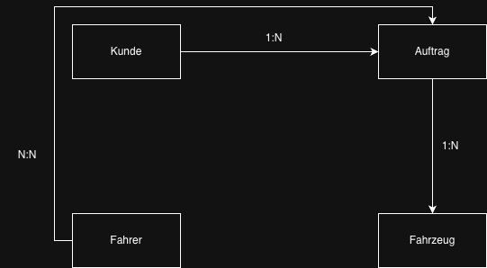
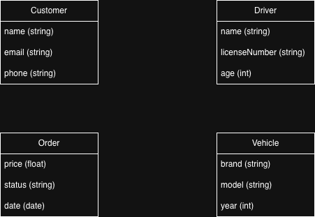
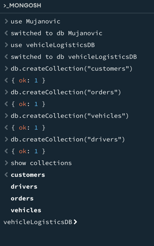

# KN-M-02: Datenmodellierung für MongoDB  
## Thema: Fahrzeuglogistik

---

# A) Konzeptionelles Datenmodell

## Beschreibung der Entitäten

Für das gewählte Thema „Fahrzeuglogistik“ wurden folgende Entitäten definiert:

- **Kunde**: Repräsentiert den Auftraggeber eines Transportauftrags.  
- **Auftrag**: Beschreibt einen Transportauftrag, der von einem Kunden erstellt wird.  
- **Fahrzeug**: Repräsentiert die zu transportierenden Fahrzeuge.  
- **Fahrer**: Repräsentiert die Fahrer, welche die Aufträge ausführen.  

---

## Beschreibung der Beziehungen

- Zwischen **Kunde und Auftrag** besteht eine **1:N-Beziehung**, da ein Kunde mehrere Aufträge haben kann, ein Auftrag jedoch genau einem Kunden zugeordnet ist.  

- Zwischen **Auftrag und Fahrzeug** besteht ebenfalls eine **1:N-Beziehung**, da ein Auftrag mehrere Fahrzeuge umfassen kann.  

- Zwischen **Fahrer und Auftrag** besteht eine **N:N-Beziehung**, da ein Fahrer mehrere Aufträge übernehmen kann und ein Auftrag von mehreren Fahrern ausgeführt werden kann.  

---

## Hinweis zum Diagramm

Das konzeptionelle Datenmodell wurde mit draw.io erstellt und als Bild exportiert.

---

# B) Logisches Datenmodell für MongoDB

## Collections

Basierend auf den Entitäten wurden folgende Collections definiert:

- customers  
- orders  
- vehicles  
- drivers  

---

## Attribute

### Customer
- name (string)  
- email (string)  
- phone (string)  

### Vehicle
- brand (string)  
- model (string)  
- year (int)  

### Order
- price (float)  
- status (string)  
- date (date)  

### Driver
- name (string)  
- licenseNumber (string)  
- age (int)  

---

## Datenstruktur und Verschachtelung

Die Collection **orders** wurde als zentrale Einheit gewählt.  
Das Diagramm zeigt die hierarchische Struktur der Daten, wobei die Collection „orders“ als zentrales Dokument dient.  

Innerhalb eines Auftrags werden weitere Informationen verschachtelt gespeichert:

- Der **Kunde** wird direkt im Auftrag eingebettet, da diese Daten häufig gemeinsam abgefragt werden.  
- Die **Fahrzeuge** werden als Array gespeichert, da ein Auftrag mehrere Fahrzeuge enthalten kann.  
- Die **Fahrer** werden ebenfalls als Array gespeichert, da zwischen Fahrer und Auftrag eine N:N-Beziehung besteht.  

Diese Struktur ermöglicht es, zusammengehörige Daten effizient abzurufen und reduziert die Notwendigkeit von Verknüpfungen zwischen Collections.

---

## Hinweis zum Diagramm

Das logische Datenmodell wurde mit draw.io erstellt.  
Die Verschachtelung der Daten (Embedded Documents und Arrays) wurde dabei visuell dargestellt, da es für MongoDB kein standardisiertes Diagrammformat gibt.  

Die Darstellung orientiert sich an der typischen Dokumentenstruktur von MongoDB.

---

## Beispielstruktur

Order
 ├─ price (float)
 ├─ status (string)
 ├─ date (date)
 │
 ├─ customer
 │    ├─ name (string)
 │    ├─ email (string)
 │    ├─ phone (string)
 │
 ├─ vehicles [ ]
 │    ├─ brand (string)
 │    ├─ model (string)
 │    ├─ year (int)
 │
 ├─ drivers [ ]
      ├─ name (string)
      ├─ licenseNumber (string)
      ├─ age (int)

---

# C) Anwendung in MongoDB

## Erstellung der Datenbank

use vehicleLogisticsDB

---

## Erstellung der Collections

db.createCollection("customers");
db.createCollection("orders");
db.createCollection("vehicles");
db.createCollection("drivers");

---

## Script-Datei (setup.js)

use vehicleLogisticsDB;

db.createCollection("customers");
db.createCollection("orders");
db.createCollection("vehicles");
db.createCollection("drivers");

---

## Anzeige der Collections

show collections

---

# Fazit

Das Datenmodell wurde zunächst konzeptionell erstellt und anschliessend auf MongoDB übertragen.  
Durch die gewählte Verschachtelung können zusammengehörige Daten effizient gespeichert und abgefragt werden.  

Insbesondere die Einbettung von Kunden, Fahrzeugen und Fahrern in den Auftrag ermöglicht eine performante und praxisnahe Datenstruktur.