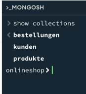
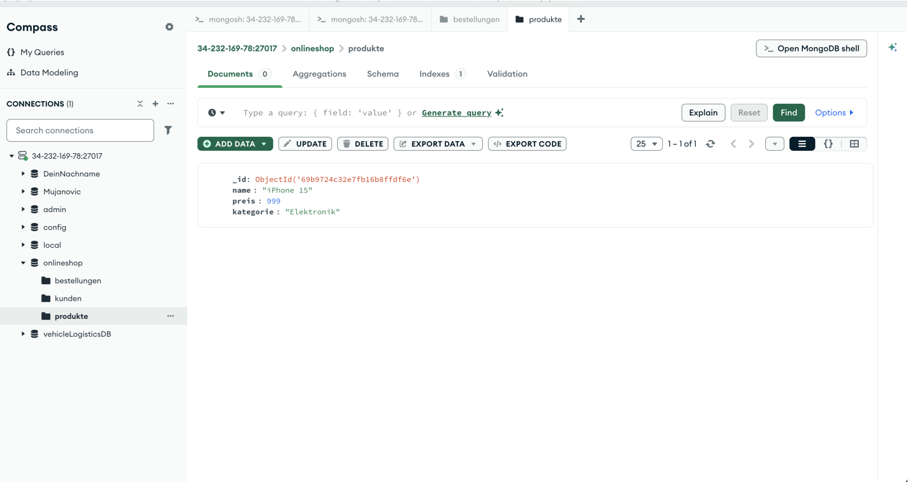
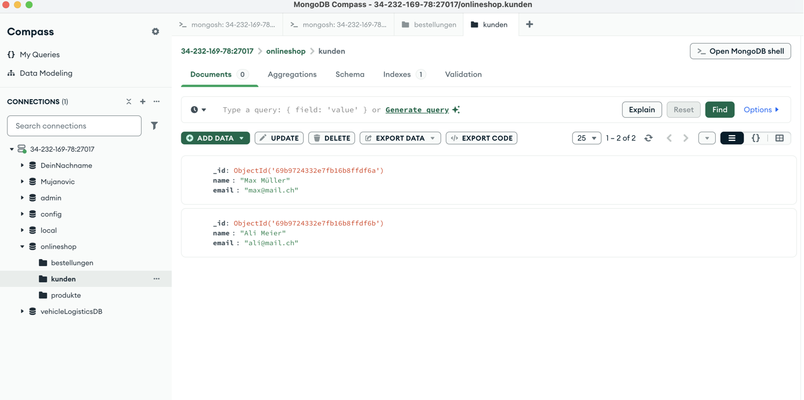
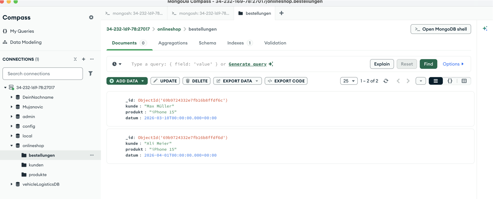
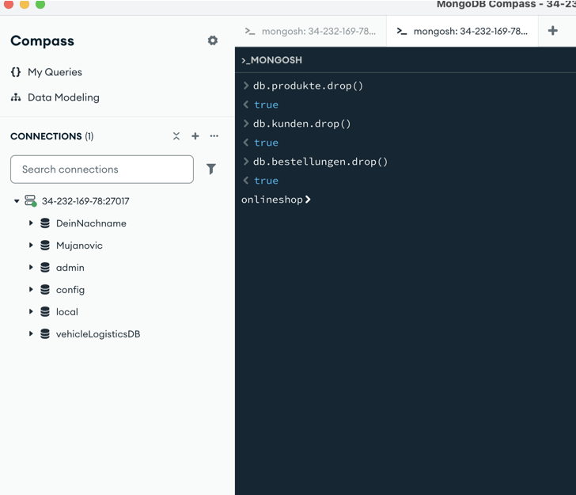
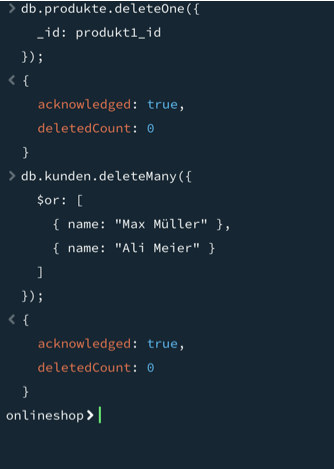
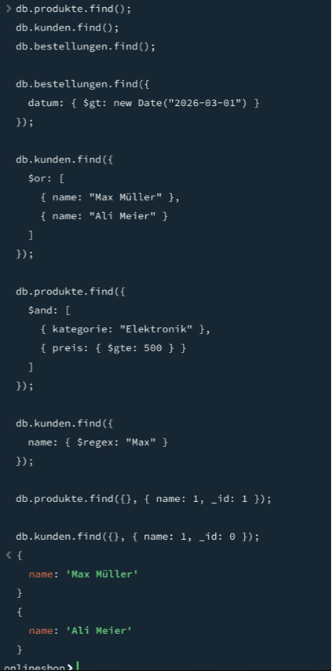
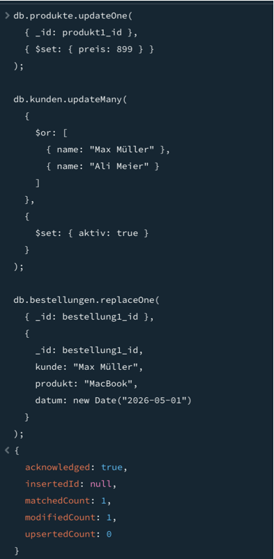
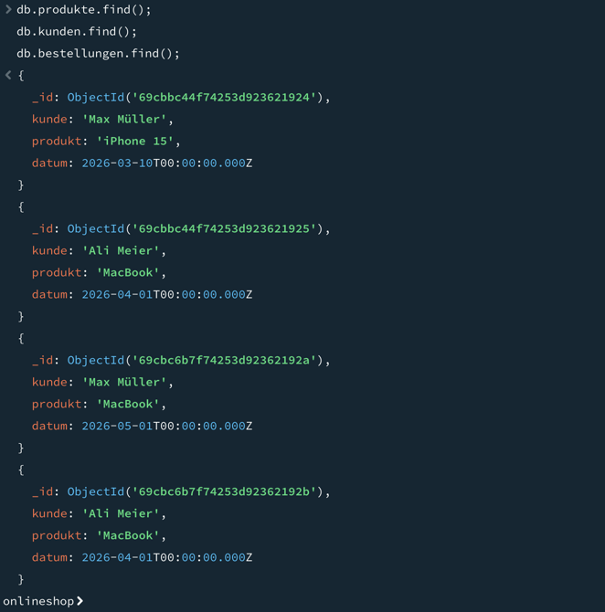

# KN-M-03: Datenmanipulation und Abfragen I

## Thema
Online-Shop mit folgenden Collections:
- produkte
- kunden
- bestellungen

---

# A) Daten hinzufügen

Es wurden Daten in die drei Collections eingefügt. Dabei wurden:

- ObjectId als Variablen verwendet
- insertOne() für einzelne Datensätze
- insertMany() für mehrere Datensätze

Die Daten enthalten Produkte, Kunden und Bestellungen mit Datum.

Screenshots:

Collections:

Produkte:

Kunden:

Bestellungen:

---

# B) Daten löschen

## 1. Ganze Collections löschen

Alle Collections wurden mit dem Befehl `drop()` gelöscht, um eine saubere Ausgangslage zu schaffen.

Screenshot:

---

## 2. Einzelne und mehrere Datensätze löschen

- deleteOne(): Löschen eines einzelnen Datensatzes
- deleteMany(): Löschen mehrerer Datensätze mit ODER-Verknüpfung

Screenshots:

---

# C) Daten abfragen

Die Daten wurden mit dem Befehl `find()` ausgelesen.

Folgende Anforderungen wurden umgesetzt:

- Abfrage pro Collection
- Filterung nach DateTime (Bestellungen nach Datum)
- ODER-Verknüpfung ($or)
- UND-Verknüpfung ($and)
- Regex zur Teilstringsuche
- Projektion mit _id
- Projektion ohne _id

Screenshot:

---

# D) Daten verändern

Die Daten wurden mit folgenden Befehlen verändert:

- updateOne(): Änderung eines einzelnen Datensatzes
- updateMany(): Änderung mehrerer Datensätze mit ODER-Verknüpfung
- replaceOne(): vollständiges Ersetzen eines Dokuments

Screenshots:

Update Befehle:

Ergebnis:

---

# Fazit

In dieser Aufgabe wurden alle CRUD-Operationen erfolgreich umgesetzt:

- Create → insertOne(), insertMany()
- Read → find() mit verschiedenen Filtern
- Update → updateOne(), updateMany(), replaceOne()
- Delete → deleteOne(), deleteMany(), drop()