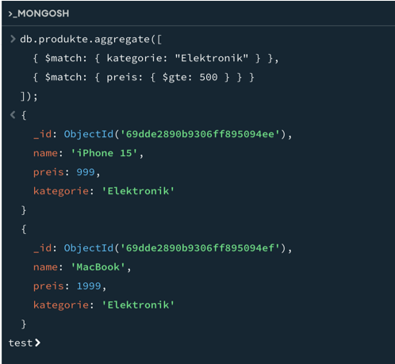
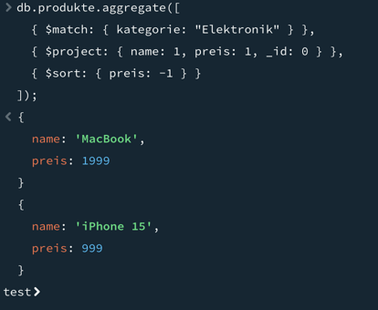
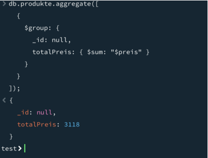
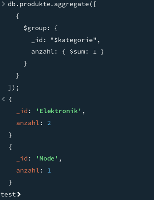
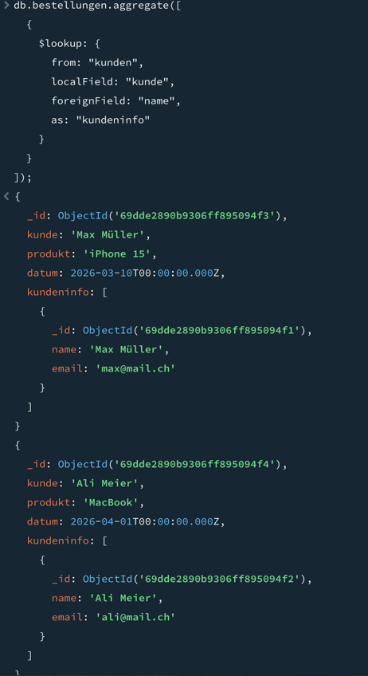
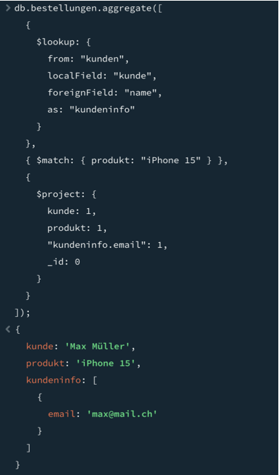
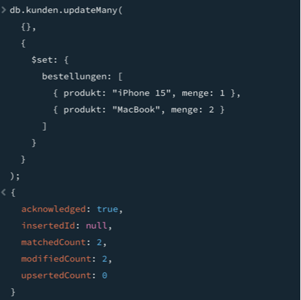
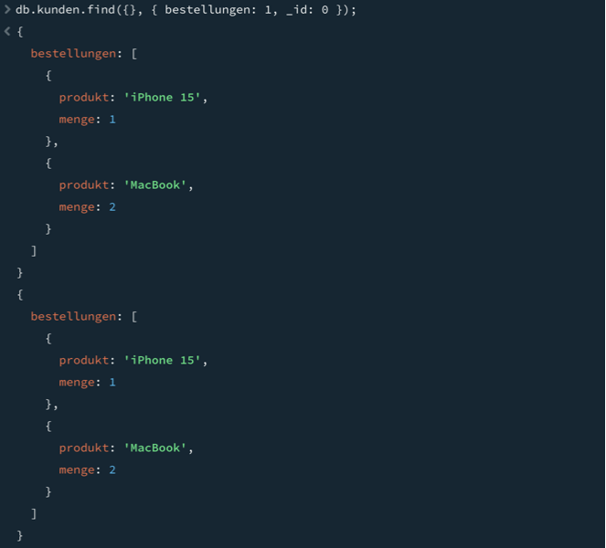
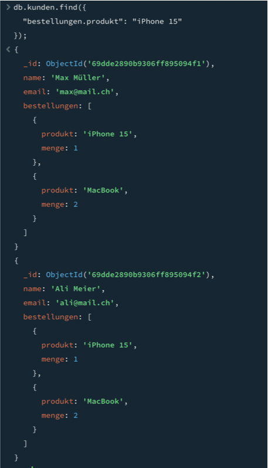
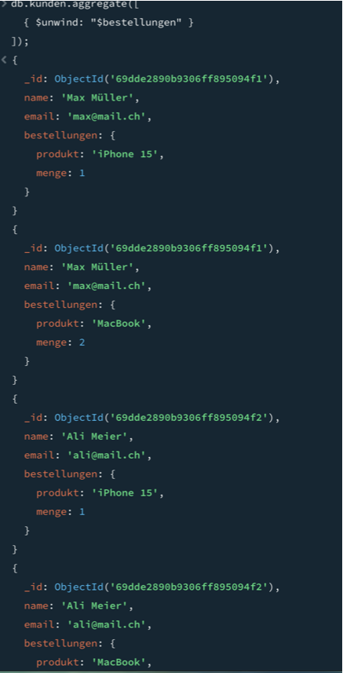

# KN-M-04: Datenmanipulation und Abfragen II

## Thema
Online-Shop mit folgenden Collections:
- produkte
- kunden
- bestellungen

---

# A) Aggregationen

In diesem Teil wurden verschiedene Aggregationen mit dem MongoDB Aggregation Framework umgesetzt.

## Umgesetzt:

- Filterung mit mehreren $match-Anweisungen (AND-Verknüpfung)
- Kombination von $match, $project und $sort
- Verwendung von $sum zur Berechnung von Summen
- Gruppierung mit $group

Screenshots:

A1 – Mehrere $match-Anweisungen:

A2 – $match + $project + $sort:

A3 – $sum (Aggregation):

A4 – $group (Gruppierung):

---

# B) Join-Aggregation ($lookup)

In diesem Teil wurde ein Join zwischen Collections durchgeführt.

## Umgesetzt:

- Verwendung von $lookup zur Verknüpfung von Collections
- Zugriff auf Felder aus beiden Collections
- Kombination von $lookup mit $match und $project

Screenshots:

B1 – Einfacher Join mit $lookup:

B2 – Join mit Filterung und Projektion:

---

# C) Unter-Dokumente / Arrays

In diesem Teil wurden Unterdokumente und Arrays verwendet und abgefragt.

## Umgesetzt:

- Anzeige von Unterdokumenten mit Projektion
- Filterung nach Feldern innerhalb von Unterdokumenten
- Weitere Verarbeitung von Unterdokumenten
- Verwendung von $unwind zur Auflösung von Arrays

Screenshots:

C1 – Anzeige von Unterdokumenten:

C2 – Filterung auf Unterdokumente:

C3 – Weitere Verarbeitung von Unterdokumenten:

C4 – Verwendung von $unwind:

---

# Fazit

In dieser Aufgabe wurden fortgeschrittene Abfragen mit MongoDB umgesetzt:

- Aggregationen mit mehreren Stages ($match, $project, $sort, $group)
- Berechnungen mit $sum
- Join-Operationen mit $lookup
- Arbeiten mit Unterdokumenten und Arrays
- Verwendung von $unwind zur Strukturierung von Daten

Alle Anforderungen der Aufgabenstellung wurden vollständig erfüllt.