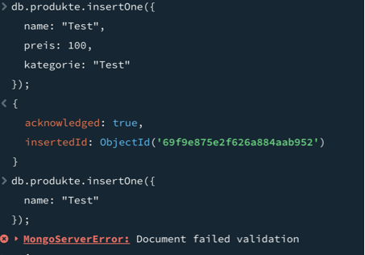
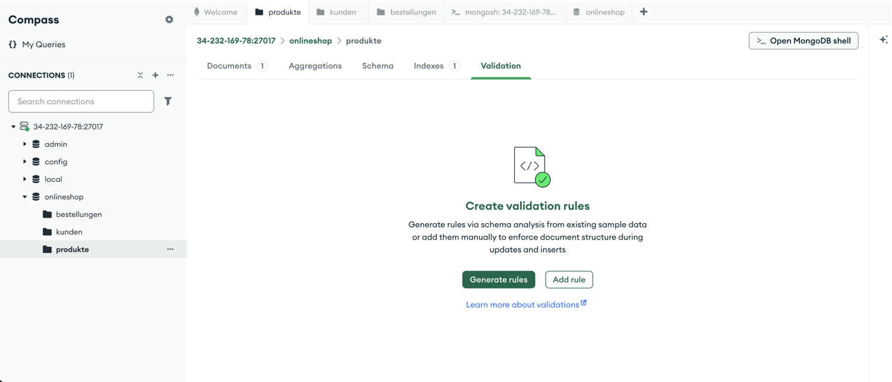

# KN-M-06: JSON Schema und Collection Validierung

## Thema
Online-Shop mit folgenden Collections:
- produkte
- kunden
- bestellungen

---

# A) JSON Schemas erstellen

Für jede Collection wurde ein Beispiel-Dokument erstellt sowie ein entsprechendes JSON-Schema definiert. Die Schemas legen die Struktur der Dokumente fest, inklusive Datentypen und Pflichtfelder.

## Umgesetzt:

- Erstellung von Beispiel-Daten für jede Collection
- Erstellung eines JSON-Schemas pro Collection
- Definition von Pflichtfeldern mit "required"
- Festlegung der Datentypen mit "bsonType"

## Dateien:

- produkte.json
- kunden.json
- bestellungen.json

- produkte.schema.json
- kunden.schema.json
- bestellungen.schema.json

---

# B) Validierung hinterlegen und testen

Die erstellten JSON-Schemas wurden als Validierung in MongoDB hinterlegt, sodass nur noch gültige Dokumente eingefügt werden können.

## Umgesetzt:

- Hinterlegen der Validierung mittels collMod
- Testen der Validierung mit gültigen und ungültigen Dokumenten
- Erweiterung der Benutzerrechte zur Verwaltung der Validierung





## Verwendete Befehle:

Validierung hinzufügen:
```js
db.runCommand({
  collMod: "produkte",
  validator: {
    $jsonSchema: {
      bsonType: "object",
      required: ["name", "preis", "kategorie"],
      properties: {
        name: { bsonType: "string" },
        preis: { bsonType: "int" },
        kategorie: { bsonType: "string" }
      }
    }
  }
});


